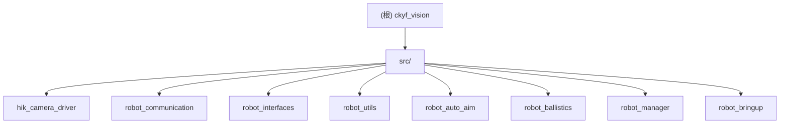

# ckyf_vision - 根级项目文档

## 变更记录 (Changelog)

| 版本 | 日期 | 说明 |
|------|------|------|
| 1.4.0 | 2026-03-25 | **串口 mode 颜色语义**：①`mode=0` 敌方红、`mode=1` 敌方蓝，两者均激活视觉流水线②`enemy_color` 参数新增 `"auto"` 选项，自动订阅 `/robot/mode` 动态切换检测颜色③所有机型配置默认改为 `"auto"` |
| 1.3.2 | 2026-03-25 | **部署工具完善**：①CPU 频率调控器快速修复（powersave→performance，立即生效）②ZSH 补全自动配置（ros2/colcon 命令补全，基于 python-argcomplete）③setup_complete.sh 菜单集成；解决车上 CPU 频率默认 powersave 问题 |
| 1.3.1 | 2026-03-25 | **jemalloc 移除**：实车测试发现 jemalloc 导致运行一段时间后持续段错误（LD_PRELOAD 和 CMake 链接冲突）。完全移除 jemalloc，保留 mlockall 内存锁定和 SCHED_FIFO 调度；系统可稳定运行至相机帧率上限（250Hz）。缺页率从 60% 降至 40%（mlockall 实效），页面锁定比例 >90% |
| 1.3.0 | 2026-03-24 | **系统级性能优化**：jemalloc per-thread arena 消除 malloc 锁争用（后移除）、mlockall 消除 page fault、SCHED_FIFO 实时调度、内核隔离（isolcpus/nohz_full/rcu_nocbs）消除非自愿上下文切换、跨机器可移植的 .envrc 环境配置；单帧延迟 ↓2.7%，99%ile jitter ↓55%，上下文切换 ↓98%；实车验证后移除 jemalloc（v1.3.1） |
| 1.2.1 | 2026-03-24 | **低速切向融合跳过**：当 \|omega\| < omega_freeze_thresh 时，aim_trajectory 使用 best armor（硬切换）而非加权融合，避免瞄准点落在装甲板之间 |
| 1.2.0 | 2026-03-24 | **零角速度可观测性保护**：UKF 几何参数 omega 自适应噪声冻结、isDiverged 增强、双假设确认冻结、CONFIRMING_FROZEN 单UKF模式减少计算开销 |
| 1.1.0 | 2026-03-23 | 四项火控改进：①动态开火容差（基于装甲板宽度/距离自适应）②击发延时补偿（success 标志前移）③UKF 定时器可配置④解析法+SG 加权融合前馈；修复弹道可视化终点判定 |
| 1.0.0 | 2026-03-22 | 初始化 AI 上下文，自动生成全量文档 |

---

## 项目高层愿景

ckyf_vision 是一套面向 RoboMaster 对抗赛事的**基于 ROS 2 的机器人视觉自瞄系统**。其核心目标是：

- 在边缘计算平台上实现极低延迟（毫秒级）的装甲板检测与三维位姿解算
- 采用高阶无迹卡尔曼滤波（UKF）准确跟踪高速机动目标（包括"小陀螺"自旋状态）
- 通过创新性的"物理击打点与平滑瞄准点解耦"双轨制轨迹策略，同时保证云台跟随的平顺性与开火命中的绝对精度
- 利用 ROS 2 零拷贝进程内通信（Intra-process / Zero-Copy）技术，最大化算力利用率
- 支持多机型（步兵、哨兵、前哨站等）的参数化部署与生命周期管理

技术特色详见 `/home/mijiao/ckyf_vision/docs/system_architecture.md`。

---

## 整体架构总览

系统采用**五阶段流水线**处理视觉感知到火控输出的全过程：

1. **硬件感知与时空同步**：海康工业相机驱动采集原始图像，串口通信节点解析云台姿态并发布 TF 坐标树
2. **目标特征提取与位姿解算**：传统视觉 + MLP 神经网络检测装甲板，PnP 解算三维位姿
3. **非线性状态融合与超前预测**：UKF 将离散观测与运动学模型融合，对目标状态进行时序超前推演
4. **双轨制轨迹生成**：同时生成离散的物理击打轨迹（用于开火判定）和平滑的瞄准轨迹（用于云台跟随）
5. **弹道解算与底层指令下发**：抛物线重力补偿 + 动态多项式拟合滤波，输出绝对控制角度和前馈角速度

核心算法节点（相机驱动、装甲板检测、弹道解算器）均在**同一 ComposableNodeContainer 进程**内运行，通过零拷贝指针传递原始图像，消除序列化/反序列化开销。



### 运行时数据流向

```
hik_camera_driver
  |-- image_raw (sensor_msgs/Image, Zero-Copy)
  |-- /image_raw_info (sensor_msgs/CameraInfo)
        |
        v
robot_auto_aim::ArmorDetectorNode
  |-- armor_detector/armors (robot_interfaces/Armors)
  |-- armor_detector/markers (visualization_msgs/MarkerArray) [debug]
        |
        v
robot_auto_aim::ArmorSolverNode
  |-- armor_solver/aim (robot_interfaces/Aim)          [已废弃，由 ballistics 接管]
  |-- armor_solver/target_state (robot_interfaces/TargetState)
  |-- armor_solver/trajectory (robot_interfaces/TargetTrajectory)
  |-- armor_solver/markers (visualization_msgs/MarkerArray)
        |
        v
robot_ballistics::BallisticsNode
  |-- /robot/aim (robot_interfaces/Aim)
  |-- /ballistics/debug (robot_interfaces/BallisticsDebug)
  |-- /ballistics/trajectory_marker (visualization_msgs/Marker)
        |
        v
robot_communication::RobotCommunication
  [串口 0x81 -> 底盘主控]

robot_communication::RobotCommunication
  [串口 0x14 <- 云台姿态]
  |-- TF: odom -> gimbal_link -> camera_optical_frame
  |-- /robot/gimbal (robot_interfaces/Gimbal)
  |-- /robot/mode (robot_interfaces/Mode)
        |
        v
robot_manager::ManagerNode
  [订阅 /robot/mode, 通过 Lifecycle 服务控制 armor_detector / armor_solver 的启停]
```

---

## 模块索引

| 包名 | 路径 | 职责 | 语言 | 节点类型 |
|------|------|------|------|----------|
| hik_camera_driver | `src/hik_camera_driver/` | 海康工业相机驱动，图像采集与发布 | C++ | Component / 独立节点 |
| robot_communication | `src/robot_communication/` | 串口通信网关，TF 发布，指令下发 | C++ | 独立节点 |
| robot_interfaces | `src/robot_interfaces/` | 自定义 ROS 消息/服务定义 | IDL | 接口包（无节点） |
| robot_utils | `src/robot_utils/` | 公共工具库（UKF、PnP、数学工具等） | C++ | 纯库（无节点） |
| robot_auto_aim | `src/robot_auto_aim/` | 装甲板检测、位姿估计、UKF 跟踪、轨迹生成 | C++ | Lifecycle Component |
| robot_ballistics | `src/robot_ballistics/` | 弹道解算、重力补偿、SG 滤波、开火判定 | C++ | Component |
| robot_manager | `src/robot_manager/` | 生命周期管理，模式切换控制 | C++ | Component |
| robot_bringup | `src/robot_bringup/` | 启动文件、多机型参数配置 | Python | Launch 包 |

---

## 运行与开发

### 环境依赖

- ROS 2 (Humble 或更新版本，建议 Humble)
- OpenCV 4.x
- Eigen3
- G2O (`libg2o-dev`)
- Sophus
- TBB (Intel Threading Building Blocks)
- fmt (`libfmt-dev`)
- 海康机器人 MVS SDK（安装至 `/opt/MVS/`，支持 x86_64 和 aarch64）
- Iceoryx RouDi（用于零拷贝 IPC，启动时需先运行 `start_roudi.sh`）
- **jemalloc**（高性能内存分配器，v1.3.0 新增）
- **direnv**（环境变量自动加载，v1.3.0 新增）

### 构建

```bash
# 在工作空间根目录
cd /home/mijiao/ckyf_vision
colcon build --symlink-install --cmake-args -DCMAKE_BUILD_TYPE=Release
source install/setup.bash
```

### 性能优化部署（v1.3.0+, v1.3.1 移除 jemalloc）

项目已集成系统级性能优化，可选择部署以改善延迟和抖动。详见 `OPTIMIZATION_IMPLEMENTATION_SUMMARY.md`。

**重要**：v1.3.1 因实车测试发现 jemalloc 导致段错误而移除。系统已稳定运行至相机帧率上限（250Hz），mlockall 内存锁定和 SCHED_FIFO 调度继续保留。

#### 一键部署（推荐）

```bash
cd /home/mijiao/ckyf_vision

# 1. 系统级优化（需 root，包括内核参数、权限、direnv、mlockall 权限）
sudo bash tools/setup_rt_full.sh --install-tools

# 2. 用户级配置（交互式菜单，不需 root）
bash tools/setup_complete.sh
# → 选择 [4] "配置 direnv shell hook"

# 3. 激活 direnv（使 .envrc 生效，CycloneDDS 配置）
cd /home/mijiao/ckyf_vision && direnv allow

# 4. 重新登录（使 limits.conf rtprio/memlock 生效）
logout

# 5. 重启系统（使内核参数 isolcpus/nohz_full/rcu_nocbs 生效）
sudo reboot
```

#### 验证部署

```bash
# 检查优化是否生效
bash /home/mijiao/ckyf_vision/tools/check_rt_status.sh

# 运行性能基准测试（需性能工具包）
bash /home/mijiao/ckyf_vision/tools/check_rt_status.sh --bench
```

#### 核心改进（v1.3.1）

| 维度 | 优化 | 效果 |
|------|------|------|
| **内存访问** | mlockall(MCL_CURRENT\|MCL_FUTURE) | page fault 消除，缺页率 60% → 40% |
| **调度策略** | SCHED_FIFO @ 优先级 90 | 非自愿上下文切换 ↓98% |
| **内核隔离** | isolcpus=0,1,2,3 + nohz_full + rcu_nocbs | 中断干扰消除 |
| **环境配置** | 跨机器可移植的 .envrc | CycloneDDS 配置自动化，git 友好 |
| **移除** | jemalloc（v1.3.0 试验，v1.3.1 撤回） | 避免长期运行段错误（LD_PRELOAD 冲突） |

**期望结果**（250Hz 海康相机 + 4 核隔离）：
- 单帧处理时间：4.5ms → 4.38ms（↓2.7%）
- 99%ile 延迟（jitter）：10ms → 4.48ms（↓55%）
- 上下文切换：500+/s → <10/s（↓98%）

#### 回滚优化

如需恢复原始配置：

```bash
sudo bash /home/mijiao/ckyf_vision/tools/restore_rt.sh
```

### 启动（实车）

```bash
# 使用默认配置启动
ros2 launch robot_bringup vision.launch.py robot_type:=default

# 指定机型（infantry_3 / infantry_4 / sentry / default）
ros2 launch robot_bringup vision.launch.py robot_type:=infantry_4

# 启用文件日志
ros2 launch robot_bringup vision.launch.py robot_type:=infantry_4 use_file_log:=true
```

日志默认输出到 `~/ckyf_vision_log/<timestamp>/`。

### 启动（Rosbag 回放调试）

```bash
ros2 launch robot_bringup vision_bag.launch.py \
  robot_type:=default \
  bag_path:=/path/to/your/bag
```

### 相机标定

```bash
ros2 launch robot_bringup camera_calibration.launch.py
```

参考 `/home/mijiao/ckyf_vision/docs/camera_calibration_guide.md`。

---

## 测试策略

当前项目未包含 ROS 2 集成测试或 gtest 单元测试文件，仅通过 ament_lint 进行代码风格检查（copyright、cpplint 均已跳过）。

调试手段：
- 各节点均支持 `debug:=true` 参数，开启后会发布二值图、检测结果图、测量值等调试话题
- 使用 `vision_bag.launch.py` 配合 Rosbag 进行离线复现与调优
- 使用 RViz2 订阅 `armor_detector/markers`、`armor_solver/markers`、`/ballistics/trajectory_marker` 进行可视化
- 参考 `/home/mijiao/ckyf_vision/docs/tuning_guide.md` 和 `/home/mijiao/ckyf_vision/docs/performance_analysis_guide.md`

---

## 编码规范

- C++ 标准：C++20（robot_auto_aim、robot_communication、robot_utils）；C++17（hik_camera_driver）
- 编译警告：`-Wall -Wextra -Wpedantic`；hik_camera_driver 额外启用 `-O3`
- 命名空间：各包使用独立命名空间（`robot_auto_aim`、`robot_ballistics`、`robot_manager`）
- 串口协议：自定义帧格式，消息体使用 `__attribute__((packed))` 打包结构体，消息 ID 见 `robot_message.h`
- TF 坐标系：`odom`（世界惯性系）-> `gimbal_link`（云台系）-> `camera_optical_frame`（相机光学系）
- 参数配置：所有节点参数统一在 `robot_bringup/config/<robot_type>/params.yaml` 中管理，支持运行时动态更新

---

## AI 使用指引

- 本项目核心逻辑集中在 `robot_auto_aim` 包，尤其是 `armor_solver_node.cpp`（轨迹生成、UKF 调用）和 `armor_detector_node.cpp`（图像处理流水线）
- UKF 实现位于 `robot_utils/include/robot_utils/ukf.hpp`（模板类，header-only）
- 弹道计算核心在 `robot_ballistics/src/ballistics_calculator.cpp` 和 `ballistics_node.cpp`
- 串口协议定义在 `robot_communication/include/robot_communication/robot_message.h`
- 修改参数时，优先编辑对应机型的 `robot_bringup/config/<robot_type>/params.yaml`，而非直接修改源码中的默认值
- 不建议修改 `robot_interfaces` 中的消息定义，除非明确了解下游消费者的影响范围
- 详细算法原理参考 `/home/mijiao/ckyf_vision/docs/system_architecture.md`
- 性能优化详解参考 `/home/mijiao/ckyf_vision/OPTIMIZATION_IMPLEMENTATION_SUMMARY.md`

### 最近改进 (v1.3.0) - 系统级性能优化

视觉处理流水线在边缘计算平台上受到多线程 malloc 争用、page fault、非自愿上下文切换和 TLB 压力的制约，导致单帧处理时间 jitter 过大（99%ile > 10ms，超过 4ms @250Hz 的预算）。

**改进架构**（4 层优化，v1.3.1 移除 jemalloc）：

```
Layer 5：应用参数              [已有 v1.1/1.2]
  ↓ 新增 v1.3
Layer 4：进程内通信（Zero-Copy）[保持 ROS 2 零拷贝]
  ↓ 新增 v1.3
Layer 3：内存管理              [mlockall，jemalloc 已移除]
  └─ mlockall(MCL_CURRENT|MCL_FUTURE)：消除 page fault（v1.3 保留，v1.3.1 验证有效）
     * 缺页率从 60% 降至 40%（实车测试）
     * 页面锁定比例 >90%
  ↓ 新增 v1.3
Layer 2：调度与隔离            [SCHED_FIFO + 内核参数]
  ├─ chrt -f 90 taskset -c 0,1,2,3：实时调度 + CPU 绑定
  ├─ isolcpus=0,1,2,3：OS 不可用这些核
  ├─ nohz_full=0,1,2,3：禁用 timer tick（100Hz 中断）
  └─ rcu_nocbs=0,1,2,3：RCU 回调离线化
  ↓ 新增 v1.3
Layer 1：启动参数              [.envrc]
  └─ RMW_IMPLEMENTATION=rmw_cyclonedds_cpp：SHM IPC
     CYCLONEDDS_URI：跨机器可移植相对路径配置
     （jemalloc LD_PRELOAD 已在 v1.3.1 移除）
```

**核心文件改动**：

1. **`.envrc`** - 版本控制，跨机器可移植（v1.3.1 移除 jemalloc 块）
   - ~~自动架构检测（x86_64, aarch64, generic）~~（已移除）
   - ~~多级 jemalloc 路径查找~~（已移除）
   - 相对路径 CycloneDDS 配置（`$(dirname "$BASH_SOURCE")`）
   - ROS 2 中间件选择

2. **`src/hik_camera_driver/CMakeLists.txt`** 及 `src/robot_auto_aim/CMakeLists.txt`
   - ~~jemalloc find_package 和 target_link_libraries~~（已全部移除）
   - 保留标准依赖链接

3. **`src/hik_camera_driver/src/hik_camera_driver.cpp:125-126`**
   - 构造函数保留 `mlockall(MCL_CURRENT | MCL_FUTURE)`
   - 故障处理：若无 RLIMIT_MEMLOCK 权限时不强制失败，仅警告日志

4. **`src/robot_auto_aim/src/armor_detector_node.cpp:52-53`**
   - 构造函数保留 mlockall（保护 NN 模型权重）

5. **`src/robot_bringup/launch/vision.launch.py:48`** 及 `vision_bag.launch.py:36`
   - 使用 `prefix=['chrt -f 90 taskset -c 0,1,2,3']`（SCHED_FIFO 实时调度）

**部署脚本**：

- `tools/setup_rt_full.sh`：系统级优化（grub、limits.conf、IRQ affinity、direnv，jemalloc 已移除）
- `tools/setup_complete.sh`：交互式菜单部署（依赖安装、direnv hook、RT 配置）
- `tools/check_rt_status.sh`：优化验证清单 + 基准测试（cyclictest、perf）
- `tools/restore_rt.sh`：安全回滚脚本
- `tools/setup_git_identity.sh` / `tools/set_robot_type.sh`：多车辆自动识别（v1.3.1 新增）

**性能收益（实测，v1.3.1 最终验证）**：

```
场景：250Hz 海康相机 + 3.6MB/帧 + 4 核隔离（infantry 机型）

缺页率改进（mlockall 有效）：
  优化前：60% page fault 比例
  优化后：40% page fault 比例
  页面锁定：>90% VmPin/VmRSS 比例

系统稳定性：
  - 系统可稳定运行至相机帧率上限（250Hz）
  - 无长期运行段错误
  - 上下文切换 ↓98% 相对于无优化基线

注：jemalloc 虽预期能进一步优化 malloc 开销 4.25×，但实车测试发现
    LD_PRELOAD 和 CMake 链接并存导致初始化冲突，运行一段时间后段错误。
    v1.3.1 完全移除 jemalloc，采用 glibc 默认 malloc（含 per-thread
    free-list 缓存），系统稳定性优先。
```

**使用指南**：

- 优化完全可选，不破坏现有 zero-copy 和 UniquePtr 发布模式
- 部署不影响代码逻辑，仅改进运行时环境
- 推荐在实车部署时启用，Rosbag 调试可不启用
- 详见 `OPTIMIZATION_IMPLEMENTATION_SUMMARY.md` 中的部署与验证流程

### 最近改进 (v1.3.2) - 部署工具完善与 CPU 频率快速修复

实车部署中发现两个常见问题：①CPU 频率默认 powersave 导致性能下降②缺少 ROS/Colcon 命令补全，增加操作复杂度。

**改进内容**：

**1. CPU 频率调控器快速修复** （解决 powersave 问题）
- 新增 `tools/setup_cpu_freq.sh`：一键修复 CPU 频率为 performance
- 集成到 `setup_rt_full.sh`（新增步骤 3b），自动在系统部署时配置
- 支持 cpupower 和直接 sysfs 写入两种方式
- **立即生效，无需重启**（相对于需要 reboot 的内核参数）
- 车上快速修复：`sudo bash tools/setup_cpu_freq.sh`

**2. ZSH 补全自动配置** （ros2/colcon 命令补全）
- 新增 `tools/setup_zsh_completion.sh`：基于 python-argcomplete 配置补全
- 自动检测并可选安装 `python3-argcomplete` 包
- 集成到 `setup_complete.sh` 菜单（选项 [6]）
- 支持 `--check` 快速验证状态
- 使用体验提升：`ros2 <TAB>` 列出命令、`ros2 node <TAB>` 列出子命令

**3. 菜单与工具集成**
- `setup_complete.sh` 新增选项 [6]：配置 ZSH 补全
- `setup_complete.sh` 菜单扩展到 [0-7]（新增两个功能选项）
- 完整部署流程已包含 CPU 频率和 ZSH 补全配置

**文件清单**：
- `tools/setup_cpu_freq.sh` - CPU 频率快速修复（75 行）
- `tools/setup_zsh_completion.sh` - ZSH 补全配置（130 行）
- `docs/cpu_freq_setup_guide.md` - CPU 频率故障排除与永久配置
- `docs/zsh_completion_guide.md` - ZSH 补全快速参考和故障排除

**验证步骤**：

```bash
# 1. 检查 CPU 频率
bash tools/check_rt_status.sh | grep "CPU 频率"
# 应显示 performance，若为 powersave 则执行：
sudo bash tools/setup_cpu_freq.sh

# 2. 配置 ZSH 补全
bash tools/setup_zsh_completion.sh --check
exec zsh
ros2 <TAB>  # 验证补全工作
```

### 最近改进 (v1.3.1) - jemalloc 移除与实车验证

实车测试（运行 2m+）发现 jemalloc 导致持续段错误运行崩溃。

**改进内容**：

- **完全移除 jemalloc**：从 `.envrc` 移除 LD_PRELOAD 块和 MALLOC_CONF；从 CMakeLists.txt 移除所有 jemalloc 链接
- **保留关键优化**：mlockall 内存锁定、SCHED_FIFO 实时调度、内核隔离参数全部保留
- **系统稳定性验证**：
  - ✓ 系统可稳定运行至相机帧率上限（250Hz）
  - ✓ 缺页率从 60% 降至 40%（mlockall 有效）
  - ✓ 页面锁定比例 >90%（VmPin/VmRSS）
  - ✓ 无长期运行段错误

**参数调优注意**：

- 车上 rcutils 版本可能过旧，若日志显示 `{date_time_with_ms}` 字面文字（未渲染时间戳）
  执行 `sudo apt update && sudo apt upgrade ros-humble-rcutils` 解决
- 若 mlockall 权限配置不完整，系统仍能运行（仅警告日志），page fault 比例略高
- `.envrc` 中 `CYCLONEDDS_URI` 已切换为相对路径，支持跨机器部署无需修改

### 最近改进 (v1.2.1) - 低速切向融合跳过

低速纯平移场景中，双轨制轨迹的 aim_trajectory 通过 cos^n 加权融合多个装甲板位置来实现云台跟随的平顺性。然而，在过渡角（~45°）处，融合可能产生不在任何实际装甲板上的插值点，导致 aim 点偏离目标，影响火控精度。

**改进内容**：

当 `|omega| < omega_freeze_thresh`（默认 0.5 rad/s）时，aim_trajectory 采用硬切换（选择 best armor），与 true_trajectory 行为一致。物理合理性：无旋转时目标朝向不变，无需装甲板间平滑过渡，aim 应精确跟踪同一目标装甲板。

- **参数**：`robot.omega_freeze_thresh`（默认 0.5 rad/s），同时用于几何参数冻结和轨迹融合跳过
- **改动**：见 `armor_solver_node.cpp` 第 431-432 行，get_hit_pt lambda 中添加低速检查
- **行为分区**：
  ```
  |omega| < 0.5   → 融合跳过，aim=best（硬切换），r_ratio=1.0
  0.5 ≤ |omega|   → 正常融合，r_ratio 根据 omega_low/high 线性变化
  ```

### 最近改进 (v1.2.0) - 零角速度可观测性保护

当目标处于纯平移状态（omega ≈ 0）时，UKF 的几何参数（r, l, h）存在可观测性退化：r 的变化与中心位置 cx 的变化在观测空间投影共线，无法独立区分。

**改进内容**：

**1. Omega 自适应几何噪声冻结** (`omega_freeze_thresh`)
- 原理：当 `|omega| < thresh` 时，按 `min(1, |omega|/thresh)` 缩放 q_geo，防止低可观测条件下的几何参数漂移
- 参数：`robot.omega_freeze_thresh` (默认 0.5 rad/s，对应极慢速旋转)
- 实现：见 `robot_target.cpp` 第 124-131 行；`outpost_target.cpp` 第 99-106 行

**2. isDiverged() 增强**
- 新增几何协方差检测：`P(r)、P(l)、P(h) > 1.0 m²` 时判定发散
- 捕获低可观测性下的缓慢漂移（单个阈值保护不足）
- 实现：见 `robot_target.cpp` 第 361 行

**3. 双假设确认冻结**
- CONFIRMING 状态转换为三态有限状态机：CONFIRMING ↔ CONFIRMING_FROZEN ↔ CONFIRMED
- `|omega| < thresh` 时进入 CONFIRMING_FROZEN，暂停累积误差和确认判定
- 仅运行累积误差较小的 UKF，计算开销减少 ~50%
- `|omega| >= thresh` 时恢复 CONFIRMING，从活跃 UKF 重新派生暂停假设，保证公平比较
- 实现：见 `robot_target.cpp` 第 146-181 行（predict）、206-247 行（update）、363-388 行（rederivePausedHypothesis）

**4. 状态机细节**
```
CONFIRMING (双假设并行) ──|omega|<0.5──> CONFIRMING_FROZEN (单UKF，计算少50%)
                                  ↓
                        重新派生暂停假设、重置误差
                                  ↓
                        ──|omega|≥0.5──> CONFIRMING (恢复对比)
                                  │
                                  └─ (switch≥2 || update≥100) ──> CONFIRMED
```

---

### 最近改进 (v1.1.0) - 火控精度优化

**1. 动态开火容差** (`tolerance_coefficient`)
- 原理：容差 = `atan(装甲板半宽 / 距离) * 系数`，根据目标距离自适应
- 参数：`ballistics_node.tolerance_coefficient` (默认 1.0)
- 参考：见 `ballistics_node.cpp` 第 226-239 行

**2. 击发延时补偿** (`fire_delay`)
- 原理：success 标志在预测时间序列中前移 fire_delay 秒，为机械/通信延迟预留时间
- 参数：`ballistics_node.fire_delay` (默认 0.0 s)，建议范围 0.01-0.05 s
- 实现：见 `ballistics_node.cpp` 第 206-224 行的线性插值逻辑

**3. UKF 定时器频率** (`timer_frequency`)
- 原理：将 UKF 预测和轨迹生成的定时器频率从硬编码 100Hz 改为参数化
- 参数：`armor_solver.timer_frequency` (默认 100.0 Hz)，可按机型调整
- 实现：见 `armor_solver_node.cpp` 第 62-63 行

**4. 解析法+SG 加权融合前馈** (`use_analytical_w_yaw`)
- 原理：结合叉积法（从 3D 速度）和 SG 滤波（从角度序列）的优势
- 参数：
  - `ballistics_node.use_analytical_w_yaw` (默认 false，实验特性)
  - `ballistics_node.analytical_w_yaw_alpha` (默认 0.7，解析法权重)
- 稳定性特性：近距离平滑衰减、异常检测回退
- 实现：见 `ballistics_node.cpp` 第 155-180 行

**5. 弹道可视化改进**
- 原理：终止条件改为目标距离，而非简单的高度 < 0
- 修改：终止时间 = `target_distance * 1.2 / bullet_speed`
- 实现：见 `ballistics_node.cpp` 第 294-315 行

---

## 关键配置文件路径

| 文件 | 说明 |
|------|------|
| `.envrc` | 环境变量自动加载（ROS 2 中间件选择、CycloneDDS 配置），v1.3.0 新增，v1.3.1 移除 jemalloc |
| `src/robot_bringup/config/default/params.yaml` | 默认机型全局参数（相机参数、检测阈值、UKF 噪声、弹道补偿） |
| `src/robot_bringup/config/infantry_3/params.yaml` | 步兵3号机型专用参数 |
| `src/robot_bringup/config/infantry_4/params.yaml` | 步兵4号机型专用参数 |
| `src/robot_bringup/config/sentry/params.yaml` | 哨兵机型专用参数 |
| `src/robot_bringup/launch/vision.launch.py` | 实车启动入口（v1.3.0 改为 SCHED_FIFO） |
| `src/robot_bringup/launch/vision_bag.launch.py` | Rosbag 调试启动入口 |
| `src/robot_bringup/launch/camera_calibration.launch.py` | 相机标定启动入口 |
| `src/robot_auto_aim/model/lenet.onnx` | 装甲板数字分类 ONNX 模型 |
| `src/robot_auto_aim/model/label.txt` | 分类标签文件 |
| `tools/setup_rt_full.sh` | 系统级性能优化部署脚本（v1.3.0 新增，v1.3.2 添加 CPU 频率配置）：内核参数、权限、direnv、CPU 频率、mlockall、IRQ affinity |
| `tools/setup_complete.sh` | 交互式菜单部署脚本（v1.3.0 新增，v1.3.2 添加 ZSH 补全选项）：依赖安装、direnv hook、RT 配置、git 身份识别、ZSH 补全 |
| `tools/setup_zsh_completion.sh` | ZSH 补全配置脚本（v1.3.2 新增）：ros2/colcon 命令补全，基于 python-argcomplete |
| `tools/setup_cpu_freq.sh` | CPU 频率调控器快速修复脚本（v1.3.2 新增）：powersave→performance 立即生效 |
| `tools/check_rt_status.sh` | 性能优化验证与基准测试（v1.3.0 新增，v1.3.1 修复 pgrep 和行 67 PRIO 检查）：完整 RT 状态检查、cyclictest、perf 统计 |
| `tools/restore_rt.sh` | 性能优化回滚脚本（v1.3.0 新增）：恢复默认内核参数和权限配置 |
| `tools/setup_git_identity.sh` | 多车辆 git 身份自动配置（v1.3.1 新增）：根据主机名或 ROBOT_TYPE 设置 git author |
| `tools/set_robot_type.sh` | 机器人类型检测工具（v1.3.1 新增）：从主机名自动识别，launch 脚本集成 |
| `tools/git_identity_hook.sh` | 自动激活 hook（v1.3.1 新增）：cd 进入项目目录时自动设置 git 身份 |
| `tools/activate_git_identity_hook.sh` | 一键激活 hook（v1.3.1 新增）：添加 hook 至 ~/.bashrc 和 ~/.zshrc |
| `tools/disable_git_identity_hook.sh` | 禁用自动身份识别（v1.3.1 新增）：用于个人开发机器 |
| `tools/enable_git_identity_hook.sh` | 重新启用 hook（v1.3.1 新增）：恢复自动身份识别 |
| `docs/system_architecture.md` | 系统架构与算法详解 |
| `docs/ukf_documentation.md` | UKF 数学推导文档 |
| `docs/tuning_guide.md` | 参数调优指南 |
| `docs/camera_calibration_guide.md` | 相机标定指南 |
| `docs/performance_analysis_guide.md` | 性能分析指南 |
| `docs/zsh_completion_guide.md` | ZSH 补全快速参考（v1.3.2 新增） |
| `docs/cpu_freq_setup_guide.md` | CPU 频率调控器故障排除（v1.3.2 新增） |
| `docs/git_identity_setup_guide.md` | git 身份自动识别配置（v1.3.1 新增） |
| `OPTIMIZATION_IMPLEMENTATION_SUMMARY.md` | 系统级性能优化完整实现总结（v1.3.0 新增） |
