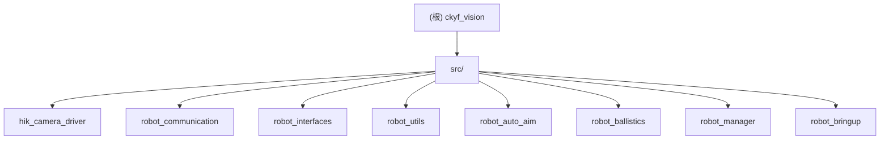

# ckyf_vision - 根级项目文档

## 变更记录 (Changelog)

| 版本 | 日期 | 说明 |
|------|------|------|
| 1.0.0 | 2026-03-22 | 初始化 AI 上下文，自动生成全量文档 |

---

## 项目高层愿景

ckyf_vision 是一套面向 RoboMaster 对抗赛事的**基于 ROS 2 的机器人视觉自瞄系统**。其核心目标是：

- 在边缘计算平台上实现极低延迟（毫秒级）的装甲板检测与三维位姿解算
- 采用高阶无迹卡尔曼滤波（UKF）准确跟踪高速机动目标（包括"小陀螺"自旋状态）
- 通过创新性的"物理击打点与平滑瞄准点解耦"双轨制轨迹策略，同时保证云台跟随的平顺性与开火命中的绝对精度
- 利用 ROS 2 零拷贝进程内通信（Intra-process / Zero-Copy）技术，最大化算力利用率
- 支持多机型（步兵、哨兵、前哨站等）的参数化部署与生命周期管理

技术特色详见 `/home/mijiao/ckyf_vision/docs/system_architecture.md`。

---

## 整体架构总览

系统采用**五阶段流水线**处理视觉感知到火控输出的全过程：

1. **硬件感知与时空同步**：海康工业相机驱动采集原始图像，串口通信节点解析云台姿态并发布 TF 坐标树
2. **目标特征提取与位姿解算**：传统视觉 + MLP 神经网络检测装甲板，PnP 解算三维位姿
3. **非线性状态融合与超前预测**：UKF 将离散观测与运动学模型融合，对目标状态进行时序超前推演
4. **双轨制轨迹生成**：同时生成离散的物理击打轨迹（用于开火判定）和平滑的瞄准轨迹（用于云台跟随）
5. **弹道解算与底层指令下发**：抛物线重力补偿 + 动态多项式拟合滤波，输出绝对控制角度和前馈角速度

核心算法节点（相机驱动、装甲板检测、弹道解算器）均在**同一 ComposableNodeContainer 进程**内运行，通过零拷贝指针传递原始图像，消除序列化/反序列化开销。



### 运行时数据流向

```
hik_camera_driver
  |-- image_raw (sensor_msgs/Image, Zero-Copy)
  |-- /image_raw_info (sensor_msgs/CameraInfo)
        |
        v
robot_auto_aim::ArmorDetectorNode
  |-- armor_detector/armors (robot_interfaces/Armors)
  |-- armor_detector/markers (visualization_msgs/MarkerArray) [debug]
        |
        v
robot_auto_aim::ArmorSolverNode
  |-- armor_solver/aim (robot_interfaces/Aim)          [已废弃，由 ballistics 接管]
  |-- armor_solver/target_state (robot_interfaces/TargetState)
  |-- armor_solver/trajectory (robot_interfaces/TargetTrajectory)
  |-- armor_solver/markers (visualization_msgs/MarkerArray)
        |
        v
robot_ballistics::BallisticsNode
  |-- /robot/aim (robot_interfaces/Aim)
  |-- /ballistics/debug (robot_interfaces/BallisticsDebug)
  |-- /ballistics/trajectory_marker (visualization_msgs/Marker)
        |
        v
robot_communication::RobotCommunication
  [串口 0x81 -> 底盘主控]

robot_communication::RobotCommunication
  [串口 0x14 <- 云台姿态]
  |-- TF: odom -> gimbal_link -> camera_optical_frame
  |-- /robot/gimbal (robot_interfaces/Gimbal)
  |-- /robot/mode (robot_interfaces/Mode)
        |
        v
robot_manager::ManagerNode
  [订阅 /robot/mode, 通过 Lifecycle 服务控制 armor_detector / armor_solver 的启停]
```

---

## 模块索引

| 包名 | 路径 | 职责 | 语言 | 节点类型 |
|------|------|------|------|----------|
| hik_camera_driver | `src/hik_camera_driver/` | 海康工业相机驱动，图像采集与发布 | C++ | Component / 独立节点 |
| robot_communication | `src/robot_communication/` | 串口通信网关，TF 发布，指令下发 | C++ | 独立节点 |
| robot_interfaces | `src/robot_interfaces/` | 自定义 ROS 消息/服务定义 | IDL | 接口包（无节点） |
| robot_utils | `src/robot_utils/` | 公共工具库（UKF、PnP、数学工具等） | C++ | 纯库（无节点） |
| robot_auto_aim | `src/robot_auto_aim/` | 装甲板检测、位姿估计、UKF 跟踪、轨迹生成 | C++ | Lifecycle Component |
| robot_ballistics | `src/robot_ballistics/` | 弹道解算、重力补偿、SG 滤波、开火判定 | C++ | Component |
| robot_manager | `src/robot_manager/` | 生命周期管理，模式切换控制 | C++ | Component |
| robot_bringup | `src/robot_bringup/` | 启动文件、多机型参数配置 | Python | Launch 包 |

---

## 运行与开发

### 环境依赖

- ROS 2 (Humble 或更新版本，建议 Humble)
- OpenCV 4.x
- Eigen3
- G2O (`libg2o-dev`)
- Sophus
- TBB (Intel Threading Building Blocks)
- fmt (`libfmt-dev`)
- 海康机器人 MVS SDK（安装至 `/opt/MVS/`，支持 x86_64 和 aarch64）
- Iceoryx RouDi（用于零拷贝 IPC，启动时需先运行 `start_roudi.sh`）

### 构建

```bash
# 在工作空间根目录
cd /home/mijiao/ckyf_vision
colcon build --symlink-install --cmake-args -DCMAKE_BUILD_TYPE=Release
source install/setup.bash
```

### 启动（实车）

```bash
# 使用默认配置启动
ros2 launch robot_bringup vision.launch.py robot_type:=default

# 指定机型（infantry_3 / infantry_4 / sentry / default）
ros2 launch robot_bringup vision.launch.py robot_type:=infantry_4

# 启用文件日志
ros2 launch robot_bringup vision.launch.py robot_type:=infantry_4 use_file_log:=true
```

日志默认输出到 `~/ckyf_vision_log/<timestamp>/`。

### 启动（Rosbag 回放调试）

```bash
ros2 launch robot_bringup vision_bag.launch.py \
  robot_type:=default \
  bag_path:=/path/to/your/bag
```

### 相机标定

```bash
ros2 launch robot_bringup camera_calibration.launch.py
```

参考 `/home/mijiao/ckyf_vision/docs/camera_calibration_guide.md`。

---

## 测试策略

当前项目未包含 ROS 2 集成测试或 gtest 单元测试文件，仅通过 ament_lint 进行代码风格检查（copyright、cpplint 均已跳过）。

调试手段：
- 各节点均支持 `debug:=true` 参数，开启后会发布二值图、检测结果图、测量值等调试话题
- 使用 `vision_bag.launch.py` 配合 Rosbag 进行离线复现与调优
- 使用 RViz2 订阅 `armor_detector/markers`、`armor_solver/markers`、`/ballistics/trajectory_marker` 进行可视化
- 参考 `/home/mijiao/ckyf_vision/docs/tuning_guide.md` 和 `/home/mijiao/ckyf_vision/docs/performance_analysis_guide.md`

---

## 编码规范

- C++ 标准：C++20（robot_auto_aim、robot_communication、robot_utils）；C++17（hik_camera_driver）
- 编译警告：`-Wall -Wextra -Wpedantic`；hik_camera_driver 额外启用 `-O3`
- 命名空间：各包使用独立命名空间（`robot_auto_aim`、`robot_ballistics`、`robot_manager`）
- 串口协议：自定义帧格式，消息体使用 `__attribute__((packed))` 打包结构体，消息 ID 见 `robot_message.h`
- TF 坐标系：`odom`（世界惯性系）-> `gimbal_link`（云台系）-> `camera_optical_frame`（相机光学系）
- 参数配置：所有节点参数统一在 `robot_bringup/config/<robot_type>/params.yaml` 中管理，支持运行时动态更新

---

## AI 使用指引

- 本项目核心逻辑集中在 `robot_auto_aim` 包，尤其是 `armor_solver_node.cpp`（轨迹生成、UKF 调用）和 `armor_detector_node.cpp`（图像处理流水线）
- UKF 实现位于 `robot_utils/include/robot_utils/ukf.hpp`（模板类，header-only）
- 弹道计算核心在 `robot_ballistics/src/ballistics_calculator.cpp`
- 串口协议定义在 `robot_communication/include/robot_communication/robot_message.h`
- 修改参数时，优先编辑对应机型的 `robot_bringup/config/<robot_type>/params.yaml`，而非直接修改源码中的默认值
- 不建议修改 `robot_interfaces` 中的消息定义，除非明确了解下游消费者的影响范围
- 详细算法原理参考 `/home/mijiao/ckyf_vision/docs/system_architecture.md`

---

## 关键配置文件路径

| 文件 | 说明 |
|------|------|
| `src/robot_bringup/config/default/params.yaml` | 默认机型全局参数（相机参数、检测阈值、UKF 噪声、弹道补偿） |
| `src/robot_bringup/config/infantry_3/params.yaml` | 步兵3号机型专用参数 |
| `src/robot_bringup/config/infantry_4/params.yaml` | 步兵4号机型专用参数 |
| `src/robot_bringup/config/sentry/params.yaml` | 哨兵机型专用参数 |
| `src/robot_bringup/launch/vision.launch.py` | 实车启动入口 |
| `src/robot_bringup/launch/vision_bag.launch.py` | Rosbag 调试启动入口 |
| `src/robot_bringup/launch/camera_calibration.launch.py` | 相机标定启动入口 |
| `src/robot_auto_aim/model/lenet.onnx` | 装甲板数字分类 ONNX 模型 |
| `src/robot_auto_aim/model/label.txt` | 分类标签文件 |
| `docs/system_architecture.md` | 系统架构与算法详解 |
| `docs/ukf_documentation.md` | UKF 数学推导文档 |
| `docs/tuning_guide.md` | 参数调优指南 |
| `docs/camera_calibration_guide.md` | 相机标定指南 |
| `docs/performance_analysis_guide.md` | 性能分析指南 |
