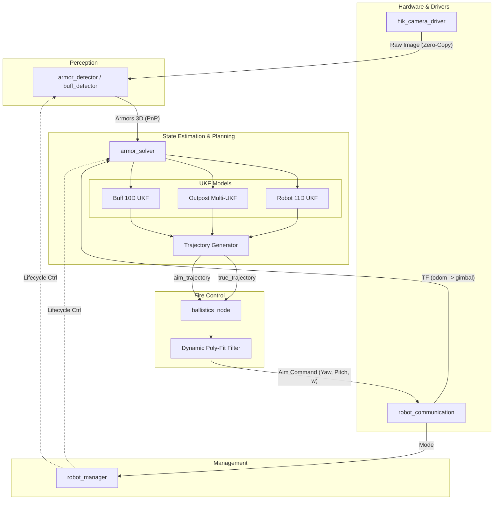

# 高动态对抗环境下的机器人视觉自瞄与能量机关打击系统架构与算法解析

## 摘要 (Abstract)

在高度复杂的机器人对抗赛事（如 RoboMaster）中，视觉自瞄系统不仅需要具备极高的目标检测召回率与实时性，还必须在目标进行高频、非线性机动（如无规则的急停急转、高速“小陀螺”自旋、能量机关的变速正弦旋转）时，提供稳定且物理精准的预测。本项目基于 ROS 2 (Robot Operating System 2) 框架，从零到一构建了一套高度模块化、低延迟的视觉感知与火控解算系统。本系统突破性地采用了零拷贝（Zero-Copy）进程内通信技术，极大地压榨了边缘计算平台的算力极限。

本文档将系统性地剖析本项目的软件架构设计理念与数据流转机制，详细推导用于状态估计的高阶无迹卡尔曼滤波（UKF）数学模型。最为关键的是，本文将深入论述本项目首创的“物理击打点与平滑瞄准点解耦”轨迹生成策略。该策略通过在径向进行阈值收缩、在切向进行余弦权重柔性融合，完美化解了传统自瞄系统中“云台跟随平顺性”与“开火命中绝对精度”之间不可调和的工程矛盾。

---

## 1. 软件架构设计与零拷贝数据流向 (Software Architecture & Data Flow)

在算力受限的机载计算平台上，图像数据的序列化与反序列化是导致系统延迟和 CPU 负载飙升的最大元凶。为了彻底消除这一瓶颈，本系统的核心算法节点被整体设计为 ROS 2 的生命周期组件（Lifecycle Components），并通过 `ComposableNodeContainer` 部署于同一操作系统的单一进程空间内。

### 1.1 系统数据流转全景 (Data Flow Pipeline)

为了清晰地展示各组件间的依赖关系与数据走向，本系统的整体架构图如下所示：

整个自瞄与打击流程被划分为五个高度内聚、低耦合的流水线阶段：

**第一阶段：硬件感知与时空同步**
系统的数据源头由两部分组成。在视觉层面，`hik_camera_driver` 节点通过直接调用海康工业相机底层的 SDK，以极高的帧率（通常为 100Hz 以上）将原始的 Bayer 格式图像或 RGB 图像拉取到内存中，并附加上精确的硬件时间戳，发布为共享内存指针。在运动学层面，`robot_communication` 节点作为一个全双工的串口网关，以固定频率轮询底盘的主控芯片，获取当前时刻云台的精确姿态（Roll, Pitch, Yaw），并利用 ROS 2 的 TF 机制，实时发布从世界惯性系（`odom`）到云台坐标系（`gimbal_link`）再到相机光学中心系（`camera_optical_frame`）的动态坐标变换树。

**第二阶段：目标特征提取与位姿解算**
图像指针直接流入 `armor_detector` 节点（或未来用于能量机关的 `buff_detector`）。在这里，图像首先经过预处理与二值化，传统视觉算法会从中提取出满足特定几何约束（长宽比、面积、倾斜角）的灯条轮廓，并将匹配的灯条对组合成候选装甲板。随后，这些候选区域的感兴趣区域（ROI）会被送入一个轻量级的多层感知机（MLP）或卷积神经网络（CNN）中，以极低的推理延迟完成颜色甄别与装甲板数字分类。一旦确认目标有效，系统将利用装甲板已知的物理长宽尺寸，调用 OpenCV 的 `solvePnP` 算法，求解出该装甲板在相机坐标系下的三维平移向量和旋转矩阵，从而完成 2D 像素到 3D 空间的跨越。

**第三阶段：非线性状态融合与超前预测**
由于目标往往处于激烈的机动状态，仅靠单帧的 PnP 观测是无法引导云台开火的。观测数据会流入预测核心节点 `armor_solver`。该节点首先查询 TF 树，将相机系下的坐标严格转换至不受云台转动影响的世界惯性系（`odom`）。随后，系统启动无迹卡尔曼滤波器（UKF），将离散、含噪的观测坐标与内部的非线性运动学模型进行融合，最优地估计出目标当前的不可见状态（如车体几何中心、自旋角速度、长短轴半径等）。在状态收敛后，系统结合子弹的飞行时间、视觉处理的流水线延迟以及机械响应的固定补偿，将目标状态沿着时间轴向前推演，生成未来的预期位姿。

**第四阶段：观测与控制的解耦轨迹生成**
这是系统进行智能决策的关键枢纽。传统的预测系统往往只输出一个未来的三维坐标，但这在目标高速自旋时会导致灾难性的后果：要么预瞄点在多块装甲板之间疯狂跳跃导致云台电机剧烈震荡甚至烧毁，要么过度平滑导致预瞄点偏离真实的装甲板表面打在空气中。为此，`armor_solver` 根据推演出的未来状态，同时生成了两组意义完全不同的轨迹序列：一组是物理上绝对真实的“击打点轨迹”，用于严苛的开火判定；另一组是经过切向加权融合与径向降维收缩的“平滑瞄准点轨迹”，专门用于引导云台电机平稳柔和地运动。

**第五阶段：弹道解算与底层指令下发**
最后，这两组携带独立时间戳的轨迹序列被发送至 `ballistics_node` 节点。在这里，目标坐标被重新转换回云台的局部坐标系。系统首先求解包含重力加速度项的抛物线方程，计算出抵消子弹下坠所需的绝对仰角补偿。紧接着，针对非均匀采样的时间序列，系统构建局部的范德蒙德矩阵进行动态的最小二乘多项式拟合，在中心时刻精确提取出平滑的角度和前馈角速度。最终，只有当物理击打点和云台瞄准点都同时满足与枪管指向的严苛角度容差时，系统才会将开火许可与运动指令一起，通过 `robot_communication` 节点打包下发至底盘硬件。

---

## 2. 核心模块与节点职责详述 (Node Responsibilities)

系统的每一个节点都被设计为职责单一、边界清晰的模块，这为后续的分布式部署、调试和多兵种适配提供了极大的便利。

*   **底层驱动层 (`hik_camera_driver`, `robot_communication`)**：
    `hik_camera_driver` 不仅负责获取图像，还负责相机内参的加载与发布，确保后续节点进行的畸变校正和 PnP 解算基于准确的物理光学模型。`robot_communication` 则扮演着软硬件隔离的代理角色，它将底层的字节流协议解析为 ROS 标准的姿态消息与 TF 变换，同时负责将上层的火控指令重新封包为硬件可读的十六进制指令帧。

*   **感知与推理层 (`ArmorDetectorNode`)**：
    该节点是算力消耗的大头。它必须在几毫秒内完成从几百万像素中剔除背景噪声、精确定位发光特征、神经网络推理到坐标系变换的全流程。其输出的 `Armor` 消息包含了目标的 3D 坐标、偏航角、分类 ID 以及置信度，是整个预测系统赖以生存的唯一数据源。

*   **状态估计与规划层 (`ArmorSolverNode`)**：
    该节点是整个自瞄系统的“大脑”。它内置了针对普通步兵、哨兵以及前哨站等不同实体的独立运动学模型机。它负责维护目标的生命周期：从首次发现的初态建立，到连续跟踪的协方差收敛，再到短暂丢失（TEMP_LOST）时利用惯性进行航迹推算，直到最终超时判定为彻底丢失。它输出的 `TargetTrajectory` 消息是控制层执行打击的根本依据。

*   **解算与火控层 (`BallisticsNode`)**：
    弹道节点专注于空间几何与物理方程的求解。它完全不关心目标是如何被识别或预测的，只关心“如果目标在未来 $t$ 秒后出现在坐标 $(x,y,z)$，云台该以多大的 Pitch 和 Yaw 去瞄准，以及当前是否允许拨弹”。这种解耦设计使得我们可以随时替换更复杂的空气动力学弹道模型，而无需修改前置的预测逻辑。

*   **生命周期与部署调度 (`ManagerNode`, `robot_bringup`)**：
    为了在比赛的不同阶段（如操作手接管与自动巡逻）合理分配算力，`ManagerNode` 会监听裁判系统下发的模式指令，利用 ROS 2 Lifecycle 机制，在毫秒级自动激活或休眠庞大的视觉计算流水线。而 `robot_bringup` 则提供了一个统筹全局的启动接口，允许开发者通过一行命令，根据 `robot_type` 参数动态加载对应车型的专有参数表（包括相机外参、预测偏置、噪声容差等），极大地简化了多车协同部署的复杂度。

---

## 3. 非线性目标状态估计：UKF 滤波模型构建 (Kalman Filter Models)

在 RoboMaster 的对抗中，除了直线冲刺，更常见的防御动作是绕自身中心的高速旋转（俗称“小陀螺”）。这类运动的观测方程（从中心点加旋转半径推导表面装甲板位置）中充斥着大量的正弦和余弦函数，表现出极其强烈的非线性特征。传统的扩展卡尔曼滤波（EKF）在计算雅可比矩阵时，对强非线性函数的线性化截断往往会导致协方差矩阵发散，甚至引发严重的估算偏差。因此，本系统全面采用了**无迹卡尔曼滤波器 (Unscented Kalman Filter, UKF)**。UKF 通过无迹变换（Unscented Transform），精心挑选一组 Sigma 点阵列来确定性地传播均值和协方差，完美保留了非线性变换后至少二阶的统计特性。

### 3.1 机器人高动态模型 (Robot Target Model)

该模型适用于所有具备底盘移动能力的实体目标（步兵、英雄、哨兵）。由于这类机器人通常装备四块装甲板，且为了适应底盘内部机构，装甲板的排布往往呈现为长方形而非正方形，我们在模型中专门引入了长短轴差值参数。

*   **状态向量定义 (11维)**: 
    我们定义系统的隐藏状态为 $X = [cx, vx, cy, vy, cz, vz, \theta, \omega, r, l, h]^T$。
    其中，$cx, cy, cz$ 及其对应的一阶导数 $vx, vy, vz$ 描述了车体几何中心在三维空间中的绝对坐标与平移线速度；$\theta$ 和 $\omega$ 描述了车体的当前朝向角（Yaw）以及它的自转角速度；$r$ 代表基准旋转半径（短轴）；$l$ 代表长短轴之间的差值补偿；$h$ 则用于补偿由于机器人结构设计导致的相邻装甲板之间的高低落差。

*   **时间更新过程 (Predict Equation)**:
    在已知时间间隔 $\Delta t$ 下，系统的运动学传播方程构建为恒定速度（CV）和恒定角速度（W）的混合模型：
    $$ cx_k = cx_{k-1} + vx_{k-1} \cdot \Delta t $$
    $$ cy_k = cy_{k-1} + vy_{k-1} \cdot \Delta t $$
    $$ cz_k = cz_{k-1} + vz_{k-1} \cdot \Delta t $$
    $$ \theta_k = (\theta_{k-1} + \omega_{k-1} \cdot \Delta t) \bmod 2\pi $$
    其余状态量（速度项及几何参数）在理想状态下视为常数，即 $X_{k} = X_{k-1}$。实际运算中，系统状态的跃变由过程噪声协方差矩阵 $Q$ 进行补偿调节。

*   **测量更新过程 (Update Equation)**:
    检测系统能够提供的观测数据仅为当前正对相机的这一块装甲板的 3D 坐标及其自身的偏航角：$Z = [ax, ay, az, \theta_{armor}]^T$。
    UKF 通过以下非线性观测函数 $Z = H(X)$ 将 Sigma 点映射到观测空间进行残差比对：
    $$ ax = cx \pm (r + l_{active}) \cos(\theta_{armor}) $$
    $$ ay = cy \pm (r + l_{active}) \sin(\theta_{armor}) $$
    $$ az = cz + h_{active} $$
    该方程精妙地建立了“不可见的车体中心”与“可见的单块装甲板”之间的刚体几何约束，驱动 UKF 在数帧之内快速收敛出真实的车体半径与角速度。

### 3.2 前哨站定点模型 (Outpost Target Model)

前哨站是固定在战场关键位置的防御堡垒，其特点是中心坐标绝对静止，且三块装甲板呈标准的 $120^\circ$ 夹角均匀分布，同时在 Z 轴上呈现阶梯状的等距高度差下降。

*   **状态向量的降维 (7维)**: 
    由于前哨站没有平移自由度，我们果断地从状态向量中剔除了 $vx, vy, vz$。优化后的状态变量精简为 $X = [cx, cy, cz, \theta, \omega, r, h]^T$。这里的 $h$ 专门代表相邻两块阶梯装甲板之间的固定物理高度差。
    降维操作极大地降低了矩阵运算的维度，使得 UKF 在处理前哨站时收敛速度呈指数级提升，也从根源上杜绝了将观测噪声误判为中心位移的可能。

*   **多重假设跟踪 (Multi-Hypothesis Tracking with 3 UKFs)**:
    在比赛中，前哨站的三块装甲板在纯视觉外观上往往是完全一致的，唯一的物理区别在于它们阶梯状的高度差。当系统在极远处或视野受限的情况下第一次观测到其中一块装甲板时，**从单帧图像根本无法区分它到底是处于高、中、还是低位**。
    如果系统只实例化 1 个 UKF 并强行假设当前观测到的是 0 号（高位）装甲板，随着前哨站的旋转，当另外两块装甲板以不符合 0 号假设的高度差出现在视野中时，由于观测与模型存在巨大的系统性偏差，该 UKF 会迅速发散。此时若要纠正假设，系统只能选择将滤波器彻底清空重启，这等同于**完全丢弃了之前好不容易收敛出来的目标中心坐标、旋转半径和自旋角速度等极其宝贵的历史先验信息**。
    为了破解这一初态模糊性难题，系统在初始化前哨站目标时，会**同时并行实例化 3 个 UKF**。这 3 个滤波器分别持有三种互斥的假设：当前观测面分别是 0、1、2 号装甲板。在后续的连续观测中，这 3 个 UKF 会各自独立推演，系统计算它们每一次的观测残差（即预测位置与实际观测位置的偏差）并进行历史累加。随着时间的推移，只有建立在正确初始假设上的那个 UKF 能够保持极小的残差并完美吻合后续出现的装甲板高度。当某个滤波器的累加误差显著小于其他两者且方差收敛时，系统才正式“确信”该假设为真，并将其状态作为唯一合法的输出。这种多重假设框架在零信息丢失的前提下，赋予了前哨站预测极强的抗混淆和初态自愈能力。

*   **独特的观测几何约束**:
    在计算观测映射 $H(X)$ 时，由于三面装甲板的夹角是严格的 $\frac{2\pi}{3}$，系统的几何推导简化为：
    $$ \theta_{armor} = \theta_{center} + id \cdot \frac{2\pi}{3} $$
    $$ ax = cx + r \cos(\theta_{armor}) $$
    $$ ay = cy + r \sin(\theta_{armor}) $$
    $$ az = cz - id \cdot h $$
    这种强约束使得即便前哨站只露出极小的一部分，系统也能瞬间推断出另外两块装甲板隐藏在空间的哪个角落。

*   **观测噪声自适应缩放 (Adaptive Measurement Noise R)**:
    在实际交战中，随着目标距离的增加或装甲板偏离视野中心，PnP 解算的深度误差会呈非线性放大；同时，当数据关联发生不确定（例如装甲板切换跳变）时，偏航角的观测也会产生巨大波动。
    为了提升极限条件下的鲁棒性，系统引入了**自适应 $R$ 矩阵**机制。在每次 `update` 前，算法会根据目标的三维距离 $d$ 对位置的观测协方差 $R_{pos}$ 进行动态缩放：
    $$ R_{adaptive\_pos} = R_{base} \cdot (1 + k \cdot d^2) $$
    对于偏航角协方差 $R_{yaw}$，当判定的最佳装甲板 ID 发生变更时，算法会瞬间将其放大几十倍（受参数 `r_yaw_adaptive_factor` 控制），以此强行降低滤波器对当前瞬间观测角度的信任度，转而依靠模型先验的角速度进行平滑惯性预测，成功过滤了切换瞬间的高频噪声毛刺。

### 3.3 能量机关变速模型 (Buff Target Model) (规划前瞻)

能量机关（大符和小符）的打击是计算机视觉的另一大挑战。大符的核心难点在于其扇叶不仅围绕一个固定圆心在倾斜的 2D 平面上旋转，而且其旋转的角速度呈现为随时间变化的复杂正弦函数。

*   **针对正弦变速的十维状态设计**: 
    我们将大符的模型定义为 $X = [cx, cy, cz, \theta_{yaw}, \theta_{roll}, v_{roll}, a, b, \omega, \phi]^T$。
    前四项确定了能量机关旋转圆盘在 3D 空间中的平移和朝向。$\theta_{roll}$ 和 $v_{roll}$ 描述了被激活扇叶在圆盘平面内的当前滚转角及瞬时角速度。
    真正的核心在于后四项参数：$a, b, \omega$ 定义了官方规则中大符转速函数 $f(t) = a \sin(\omega t) + b$ 的振幅、偏置和频率。而 $\phi$ 则是我们独创的**虚拟相位变量**，用于替代不可靠的绝对系统时间 $t$。

*   **基于相位的自回归更新**:
    在 UKF 的时间推演步骤中，我们利用系统内部的时间间隔 $\Delta t$ 自主推演相位的流转，并进而计算出瞬时速度与角度的积分：
    $$ \phi_k = \phi_{k-1} + \omega_{k-1} \cdot \Delta t $$
    $$ v_{roll, k} = a_{k-1} \sin(\phi_k) + b_{k-1} $$
    $$ \theta_{roll, k} = \theta_{roll, k-1} + v_{roll, k-1} \cdot \Delta t $$
    通过将复杂的绝对时间域函数巧妙地转换为相邻时刻的相对相位推演，UKF 能够仅凭借相机每帧捕捉到的离散扇叶位置，就像拼图一样逐步逆向逼近出隐藏的正弦波参数 $a$ 和 $\omega$。一旦这几个参数收敛，系统就能突破视觉延迟的限制，精准预测出子弹到达时刻扇叶的绝对坐标。

---

## 4. 预测与控制的核心矛盾：物理击打与平滑瞄准的完全解耦

自瞄系统工程化落地的最大痛点在于：**物理上真实的目标运动是离散跳跃的，而机械上云台电机的控制输入要求是绝对连续平滑的。**
当敌方机器人进入高频“小陀螺”旋转时，相机视野中原本锁定的装甲板会转到背面消失，另一块全新的装甲板会从侧面突然出现。如果控制系统直接将这个瞬间跳变了十几厘米的三维坐标强塞给云台的 PID 控制器，电机的反馈会表现为极其狂暴的震荡，不仅根本无法瞄准，甚至可能引发机械结构的共振和损坏。而若是简单粗暴地在末端套用一个低通滤波器，虽然云台安静了，但平滑后的瞄准点会像拖着一条长长的尾巴一样，彻底偏离真实的装甲板表面，导致子弹全部打在空气中。

为了彻底粉碎这一技术瓶颈，本项目的 `ArmorSolverNode` 在预测流水线的最后一步，革命性地采用了**双轨制轨迹生成算法**。它从收敛的卡尔曼状态中，同时、独立地生成了两条不同使命的运动轨迹。

### 4.1 真理的标尺：物理击打轨迹 (`true_trajectory`)

这条轨迹唯一的使命就是用来进行严苛的**开火时机判定**。它必须绝对忠实于物理世界的真理，容不得半点虚假的平滑。
在计算未来时间点 $t_{predict}$ 上的轨迹坐标时，系统会基于当时刻的预测偏航角 $\theta$，计算出所有四面装甲板在三维空间中的法线朝向。随后，算法严谨地寻找与当前相机视线夹角 $\min | \theta_{origin} - (\theta_{armor} + \pi) |$ 最小的那一块装甲板（即正对枪口的一面）。
最终生成的 `true_trajectory` 序列中，当目标旋转过某个临界点时，坐标数据会原封不动地保留那一次巨大的跳跃。在后续的 `BallisticsNode` 中，发弹逻辑会死死盯着这条轨迹：只有当这条轨迹上包含真实物理实体坐标的点，精确落在枪管允许的极小容差圆内时，电控才会收到允许扣动扳机的信号。

### 4.2 驯服机械的缰绳：平滑瞄准轨迹 (`aim_trajectory`)

这条轨迹的使命是为云台电机提供一个丝滑如丝的**前馈追踪目标**。它不需要在每一个瞬间都必须踩在装甲板的中心，它只需要以最优雅的姿态扫过整个目标区域，引导枪管在合适的时机与真实装甲板交汇即可。系统通过两层维度对目标进行了柔性重塑：

**第一层：切向的软切换融合 (Tangential Soft Blending)**
为了消除装甲板交替时的阶梯状跳变，算法摒弃了非黑即白的“唯一最优解”逻辑，引入了基于余弦指数的权重分配机制。系统计算出每一块装甲板偏航角与中心视线的夹角 $\Delta \theta$，并通过强收敛函数 $W = \cos^{n}(\Delta \theta)$ 赋予其动态权重（其中 $n$ 为由参数 `switch_concentration` 决定的专注度）。
最终的平滑瞄准点通过加权平均得出：
$$ \vec{P}_{blend} = \frac{\sum_{j} W_j \cdot \vec{P}_{armor, j}}{\sum_{j} W_j} $$
通过这种柔性融合，当旧装甲板逐渐偏离视线时，其权重如同缓释的曲线般逐渐归零，而新转入视野的装甲板权重则平滑地从零爬升。结果是，引导坐标在两块装甲板交接的虚空处画出了一条平滑的弧线，彻底根除了阶跃信号对云台控制的冲击。

**第二层：径向的降维收缩 (Radial Threshold Shrinkage)**
即便解决了切向的跳变，当目标自旋角速度 $|\omega|$ 达到变态级别（例如每秒旋转几圈）时，要求云台电机以相同的角速度去追踪表面的装甲板在物理极限上是不可能完成的。
为此，系统引入了转速收缩机制。我们设定了两个经验阈值 `omega_low` 和 `omega_high`。当目标的转速极其缓慢，低于 `omega_low` 时，系统认为云台完全有能力跟上，此时瞄准点就锁定在装甲板表面的融合半径上。一旦转速超过这个阈值，系统会启动线性收缩插值：随着转速向 `omega_high` 逼近，瞄准点的位置会如水滴般沿着半径方向，慢慢向车体的旋转中心点滑落。当转速突破 `omega_high` 的极限时，瞄准点将完全固定在车体几何中心上岿然不动。此时云台将静静地停在目标中央，犹如守株待兔，等待着高速旋转的装甲板一次次自己撞进枪管的弹道线上。

### 4.3 传统方案对比与本架构的代差优势 (Generational Advantage vs. Traditional Approaches)

在视觉自瞄系统的演进历程中，针对目标高速自旋（如“小陀螺”状态）的轨迹生成与跟随策略一直是各大赛队技术攻坚的焦点。为了更深刻地理解本系统“物理与控制解耦”策略的革命性意义，我们有必要详细回顾并对比现有的几种主流自瞄方案。

#### 1. 传统两档硬切换方案 (Hard Switching)
这是早期最为普遍的一种处理策略，其核心思想是“非黑即白”的粗暴决策。
*   **算法原理**：通过卡尔曼滤波器估算出目标的自旋角速度 $\omega$。设定一个经验转速阈值 $\omega_{th}$。当目标转速 $|\omega| < \omega_{th}$ 时，算法直接在三维空间中寻找当前面向相机的最优装甲板，并将其绝对坐标作为云台的目标点；当转速突增导致 $|\omega| > \omega_{th}$ 时，系统认为云台已无力跟随单块装甲板，于是强行切断对表面装甲板的跟随，将目标点瞬间切换至车体的几何中心。为了避免转速在阈值边缘徘徊时引发疯狂切换，部分进阶方案会加入一个迟滞比较器（Hysteresis Comparator）。
*   **致命缺陷：不可避免的空间阶跃冲击**
    无论是否加入迟滞比较器，这种方案都无法逃避一个物理死结——当机器人在低转速下进行机动，且旧的装甲板即将转到背面、新的装甲板刚刚从侧面显露的那个瞬间，系统的目标输出坐标会发生一次剧烈的空间跳变。考虑到一台机器人的旋转直径约为 40-50 厘米，这个跳变幅度在三维空间中通常高达十几厘米。
    如果控制系统直接将这个瞬间突变的离散坐标强塞给云台的底层 PID 控制器，电机会试图在极短的时间内爆发出不可能达到的加速度去弥补这个空间误差。其外在表现就是云台发生极其狂暴的震荡、电机发出刺耳的啸叫，不仅根本无法形成稳定的瞄准线，长时间运行甚至可能引发机械结构的疲劳共振与损坏。

#### 2. 末端一维角度滤波方案 (1D Angle Filtering / Simple Improvement)
为了掩盖硬切换方案带来的机械震荡，许多开发者试图在控制的最后一步“打补丁”，即引入末端角度滤波。
*   **算法原理**：流水线的前端依然保留装甲板的“硬切换”逻辑。但在系统利用坐标解算出云台所需偏航角（Yaw）和俯仰角（Pitch）之后，在这两个一维的角度变量上强行套用一个低通滤波器（Low-pass Filter）或常规的 Savitzky-Golay 滤波器。其目的是把由于坐标跳变引起的角度阶跃信号强行“抹平”。
*   **致命缺陷：降维打击导致的“数学伪影”**
    这是一种典型的**“丢失空间物理信息”**的错误工程妥协。三维世界中的物体运动投影到球坐标系（Yaw/Pitch）后，其变化是非线性的。当真实的装甲板发生切换时，发生跳变的不仅仅是横向的 X/Y 坐标，更关键的是深度（Z轴，即距离）和物理高度（由于车辆倾斜或机构设计）也随之突变。
    如果在丢失了 3D 深度信息的前提下，单纯对 1D 的 Yaw 角或 Pitch 角进行数学平滑，就会引发奇异的**“锯齿状回撤”**现象。举个例子：当目标在向右上方移动且发生装甲板切换时，真实的物理轨迹本该是持续升高的；但由于一维滤波器未能理解深度的瞬时衰减，在平滑跳跃数据时，它会强行在两个原本不相关的角度值之间插值，导致云台的实际响应变成“先诡异地下降一小段，然后再猛然拉升”。这种纯粹由降维数学运算产生的伪影，不仅让云台在切换瞬间发生奇怪的反向抽搐，更是使得那一瞬间发射的子弹由于错误的俯仰角而必定脱靶。

#### 3. 本架构：保留 3D 信息的连续化重塑 (Continuous 3D Spatial Blending)
与上述试图在下游控制端“擦屁股”的方案截然不同，本系统从上游的物理空间就彻底解决了这个问题。
*   **降维打击的反制：三维空间的连续化**
    本系统的先进性在于，**平滑的过程严格发生在真实的 3D 物理空间，而非降维后的 1D 控制空间**。我们在进行任何弹道角度解算之前，就已经通过 $\cos^n(\Delta\theta)$ 的余弦权重函数，对所有可见装甲板的物理坐标进行了强收敛的加权融合。当旧装甲板逐渐偏离视线时，其三维坐标的权重如同缓释曲线般平滑衰减至零；同时，新装甲板的三维坐标权重平滑爬升。
    这个过程，相当于用纯粹的数学手段，在真实的三维空间中，硬生生把离散跳变的装甲板重塑成了一条绝对连续、且二阶可导的虚拟弧线。
*   **降维解耦：机械顺滑与绝对命中的完美统一**
    经过上述处理，后续的弹道解算器获取到的输入不再是跳跃的散点，而是一个真正在目标表面平滑滑动的虚拟质点。在这个连续的 3D 轨迹上再去求解 Yaw 和 Pitch，并结合局部的动态多项式拟合，得到的就是完美无瑕、绝无倒退伪影的前馈角速度。云台电机在接收到这样的信号时，运转将如丝绸般顺滑。
    但如果你认为我们为了追求平滑而牺牲了精度，那就大错特错了。我们在生成平滑瞄准点（`aim_trajectory`）的同时，独创性地在另一条独立线程中保留了绝对真实的离散跳变点（`true_trajectory`）。发弹控制器会死死盯着这条“真实轨迹”，只有当那块跳变的真实装甲板精确落在枪管允许的极小容差圆内时，才会触发射击。
    这种将**“瞄准跟踪的极度平顺化”**与**“击打开火的绝对离散化”**进行彻底降维解耦的设计，使得本系统在机械跟随友好度与物理命中绝对精度上，对传统方案形成了代差级的碾压优势。

---

## 5. 弹道解算与时域动态滤波 (Ballistics & Time-Domain Command Filtering)

完成了预瞄点的空间重塑后，任务的最后一棒交由 `BallisticsNode` 接管，它负责将空洞的三维坐标翻译为电机能够理解的绝对控制指令。

### 5.1 考虑空间曲率的抛物线重力补偿 (Gravity Compensation via Parabolic Solver)
虽然子弹的速度高达 25~30m/s，但在几米的交战距离上，地球重力带来的下坠依然会造成几厘米的致命偏差，这往往就是击中与脱靶的界限。
算法首先将惯性系下的预测点严谨地转换到当前云台的相对坐标系（`gimbal_link`）下。取目标在水平面上的投影距离为 $d = \sqrt{x^2 + y^2}$，垂直高度差为 $z$。在忽略空气阻力的近似模型下，子弹以初速 $v$ 射出后，其命中目标的运动学轨迹方程可简化为：
$$ z = d \cdot \tan(\theta) - \frac{g \cdot d^2}{2 \cdot v^2} \cdot \left(1 + \tan^2(\theta)\right) $$
这是一个关于 $u = \tan(\theta)$ 的一元二次标准方程。节点在代码中通过求解该方程的判别式 $\Delta$，直接计算出精确的枪管仰角补偿量 $\theta_{pitch}$。为了保证程序的鲁棒性，当判别式 $\Delta < 0$ 意味着目标高度超出了物理极限射程时，算法会自动退化为不考虑重力的基础直线映射 $\arctan(z/d)$，以确保解算在任何极端条件下都不会崩溃或输出 NaN。

### 5.2 消除时间歧义的动态多项式拟合滤波 (Dynamic Polynomial Least-Squares Filter)
为了向云台提供可用于前馈控制的精确角速度（$\omega_{yaw}, \omega_{pitch}$），早期版本使用了经典的 Savitzky-Golay 卷积滤波器。然而，传统的 S-G 滤波建立在一个致命的前提上：数据必须是等时间间隔（$dt$ 恒定）采样的。但在高度异步的 ROS 通信和多线程解算环境下，时间序列往往充斥着细微的抖动，强行代入固定的 $dt$ 会在微观尺度上产生难以消除的数值阶梯和毛刺。

为此，本系统抛弃了预计算的卷积系数，实现了完全基于序列真实时间戳的**动态最小二乘局部多项式拟合算法**。
在面对一段长度为 $N$ 的预测角度序列及其对应的不规则时间偏移向量 $(t_i, y_i)$ 时，系统以中心预测时刻（$t=0$）为基准，实时构造范德蒙德矩阵 (Vandermonde Matrix) $X$：
$$ X = \begin{bmatrix} 1 & t_0 & t_0^2 & \cdots & t_0^k \\ 1 & t_1 & t_1^2 & \cdots & t_1^k \\ \vdots & \vdots & \vdots & \ddots & \vdots \\ 1 & t_{N-1} & t_{N-1}^2 & \cdots & t_{N-1}^k \end{bmatrix} $$
随后，通过稳健的 QR 分解实时求解正规方程 $(X^T X)\beta = X^T Y$，直接获取多项式系数向量 $\beta$。在这个多项式中，$\beta_0$ 即代表在目标时刻精准平滑后的期望偏航角或俯仰角，而 $\beta_1$ 则是它在此时刻严格数学意义上的一阶导数（即我们苦苦追寻的前馈角速度）。
这一算法不仅彻底免疫了时间戳抖动带来的干扰，更通过调整拟合阶数（推荐使用 4 阶），完美地适应了目标进行圆周旋转时在笛卡尔坐标系中投影出的高曲率正弦轨迹，将预测的顺滑度提升到了一个全新的理论高度。

---

## 6. 结语 (Conclusion)

本系统的研发是一次将严谨数学理论与苛刻工程实践深度融合的探索。通过高度模块化的节点拆分与进程内零拷贝技术的运用，系统在底层保证了极致的执行效率与运行稳定性。而其上层建筑——基于高阶 UKF 的非线性追踪体系、首创的“物理与控制”双轨制轨迹解耦生成框架，以及基于动态局部多项式拟合的弹道解算机制——共同构筑了一道坚不可摧的技术壁垒。这不仅使机器人在瞬息万变的赛场上获得了如同猎豹般敏锐且从容的打击能力，更为后续更多元化的自动化兵种（如英雄、无人机等）战术体系的扩展，铺设了一条宽广而坚实的高速公路。